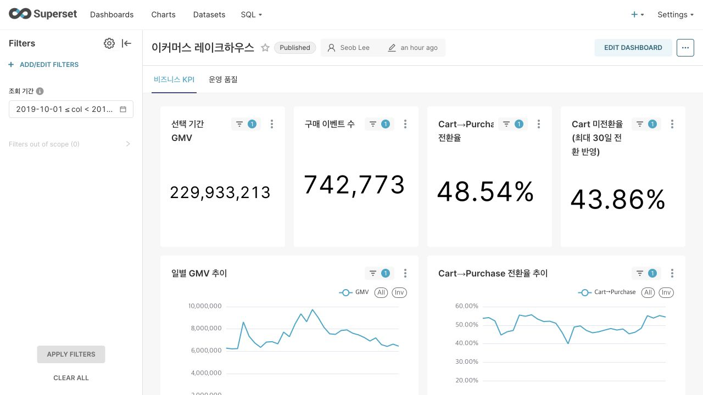
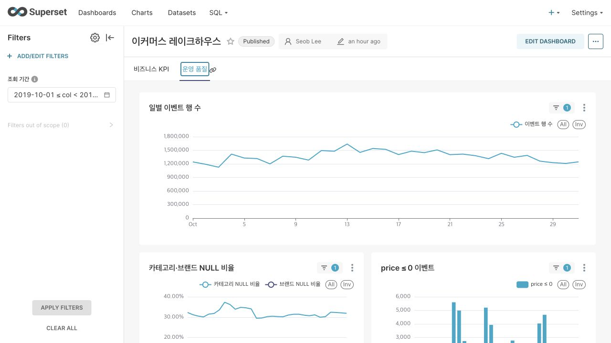

# 이커머스 행동 로그 기반 Iceberg 데이터 플랫폼

Kafka로 재생한 이커머스 행동 로그를 Flink로 S3 Bronze에 적재하고, Spark와 Iceberg로
Silver/Gold를 구성한 뒤 Athena와 Superset으로 조회하는 데이터 플랫폼 프로젝트다.

| 영역 | 상태 | 범위 |
| --- | --- | --- |
| 수집·Bronze | 완료 | Kafka 토픽 분기, Flink 독립 잡, S3 Parquet 적재 |
| Silver·Gold | 전체 적재 완료·증분 보완 예정 | Iceberg 테이블 7개, 일 단위 Gold 5개 |
| 조회·대시보드 | 완료 | Superset 데이터셋 7개·지표 22개·차트 15개, PostgreSQL 메타DB·Redis 캐시 |
| Iceberg 관리 | 실험 완료 | 컴팩션·스냅샷 만료·고아 파일 정리 검증 |
| 운영 설계 | 진행 예정 | 헬스 쿼리 5~10개, Iceberg 관리 자동화, 100x 확장, 장애 시나리오, 증분 처리 보완 |

## 1. 도메인과 핵심 KPI

데이터셋은 Kaggle의 [eCommerce behavior data from multi category store](https://www.kaggle.com/datasets/mkechinov/ecommerce-behavior-data-from-multi-category-store)다.
전체 7개월 약 2.85억 건 중 현재는 **2019년 10월 4,245만 건**을 사용한다.

| KPI | 정의 | 대상 |
| --- | --- | --- |
| GMV | `purchase` 이벤트의 `price` 합 | 경영진 |
| 퍼널 전환율 | `(user_session, product_id)`별 view·cart·purchase 존재 여부 | 마케팅 |
| Cart 이탈률·미전환 금액 | cart 이후 purchase로 연결되지 않은 비율과 금액 | 마케팅 |
| 카테고리 GMV | 카테고리별 GMV 기여도 | 상품팀 |
| 운영 품질 | 지연, NULL, 가격 이상치, Iceberg 테이블 상태 | 데이터팀 |

`order_id`, `cart_id`, `quantity`가 없어 실제 주문 단위는 복원할 수 없다. 따라서 대시보드에서도
**구매 건수**가 아니라 **purchase 이벤트 수**로 표기한다.

## 2. 전체 아키텍처

| 구간 | 구성 | 핵심 결정 |
| --- | --- | --- |
| 수집 | CSV gzip → Kafka | `event_type`별 3개 토픽, `key=user_id` |
| 스트리밍 | Flink Table API | 토픽별 독립 잡과 체크포인트 복구 |
| Bronze | S3 plain Parquet | 수집 시각 파티션, append-only 원본 보존 |
| Silver·Gold | Spark + Iceberg + Glue | 발생 시각 파티션, 재처리와 과거 갱신 지원 |
| 조회·BI | Athena + Superset | 서버리스 조회, 비즈니스·운영 탭 분리, PostgreSQL 메타DB·Redis 캐시 |

Flink는 레코드 단위 수집과 복구에, Spark는 MERGE·self-join·일 단위 집계에 사용한다.
조회는 상시 클러스터가 필요 없는 Athena로 통일했다.

## 3. 메달리온 계층

| 계층 | grain | 역할 |
| --- | --- | --- |
| Bronze | 이벤트 1건 | 원본 보존과 수집 메타데이터 추가 |
| `silver_events` | 이벤트 1건 | dedup·타입 캐스팅·카테고리 분해 |
| `silver_funnel` | `(user_session, product_id)` | 흩어진 행동을 하나의 여정으로 조립 |
| Gold 5개 | 날짜·차원별 집계 | KPI와 운영 지표 제공 |

GMV는 이벤트 중복 구매가 접히지 않도록 `silver_events`에서 계산한다. 전환율·이탈률은
`silver_funnel`에서 계산한다. 서로 다른 grain의 테이블에서 같은 지표를 중복 계산하지 않는다.

cross-session 전환은 30일 동안 추적한다. 7일에서 30일로 늘리자 지연 전환은
340,535건에서 **394,493건**으로 증가했다. 최대 전환 간격이 29.97일로 경계에 닿고 데이터도
31일뿐이므로, 이 값은 최종치가 아니라 **관측 가능한 하한**이다.

Gold는 KPI별 SQL과 테이블로 분리하며 모두 `overwritePartitions()`로 날짜 파티션을 다시 계산한다.

| 테이블 | 역할 |
| --- | --- |
| `gold_daily_gmv` | GMV |
| `gold_funnel_daily` | 전환율·이탈률·미전환 금액 |
| `gold_category_gmv` | 카테고리·브랜드·상품 기여도 |
| `gold_pipeline_sla` | 처리 지연 |
| `gold_data_quality` | NULL·가격·행동 품질 |

## 4. Iceberg가 필요한 이유

후속 구매가 발생하면 과거 `silver_funnel` 행의 `converted_later`가 바뀐다. plain Parquet에서는
파일 재작성과 이력 관리를 직접 구현해야 하지만, Iceberg는 MERGE·파티션 교체·스냅샷으로 처리한다.

| 검증 항목 | 결과 |
| --- | --- |
| COW 재작성 | 한 컬럼 UPDATE에 1,329,334행 / 105~118MB 재작성 |
| 파티션 가지치기 | 하루 2.28MB vs 전체 31일 78.3MB, 약 34배 차이 |
| 지연 전환 | 30일 기준 394,493건 |

최근 30일 행이 후속 구매로 갱신될 수 있으므로 스냅샷도 최소 30일 보관하는 방향으로 설계한다.
`expire_snapshots`, `remove_orphan_files`, 데이터 파일·매니페스트 재작성을 직접 실행해 동작과 제약을 확인했다.

## 5. 운영 헬스 체크 쿼리

`rewrite_data_files`, `rewrite_position_delete_files`, `rewrite_manifests`의 전후 상태를 비교하는
컴팩션 데모를 구현했다. Superset 운영 탭에서는 일별 행 수·지연·NULL·가격 이상치와 Iceberg 파일
상태를 확인한다. 메타테이블 기반 일상 점검 쿼리 5~10개와 Iceberg 관리 자동화는 아직 미구현이다.

## 6. Superset 대시보드

기본 조회 기간은 `2019-10-01 ≤ date < 2019-11-01`이며 총 15개 차트를 두 탭으로 분리했다.

- **비즈니스 KPI**: GMV, purchase 이벤트 수, Cart→Purchase 전환율, Cart 미전환율(최대 30일 전환 반영),
  일별 추이, 카테고리 GMV, 미전환 장바구니 금액
- **운영 품질**: 일별 행 수, NULL 비율, `price ≤ 0`, 세션 내 view 없는 purchase,
  파이프라인 지연, Iceberg 파일 수·평균 크기·행 수·최종 갱신 시각

원본 데이터에 통화 정보가 없어 금액에 통화 기호를 붙이지 않았다. Cart 이탈률은 30일 윈도우와
31일 관측 기간의 영향을 받으므로 상한으로 해석한다.

Gold의 `ALL` 행과 카테고리 행을 함께 집계하거나 여러 `dim_type`을 합치면 값이 조용히 중복된다.
이를 가상 데이터셋 필터로 차단하고, 비율은 일별 비율의 평균 대신 `SUM(분자)/SUM(분모)`로 계산한다.

### Superset 구성

Superset은 Docker Compose로 구성하고 애플리케이션과 상태 저장소를 분리했다. 사용자·데이터베이스
연결·대시보드 등의 메타데이터는 PostgreSQL 16에, 대시보드 필터와 Athena 조회 결과 캐시는
Redis 7.2에 저장한다.

데이터베이스 연결부터 탭 배치와 기간 필터까지 Superset 공식 YAML 형식으로 export해
[`dashboard/superset`](dashboard/superset)에 보관했다. 새 메타DB에서 이를 가져와 데이터셋 7개,
차트 15개, 대시보드 1개가 복원되는 것도 확인했다.

현재 구성은 로컬 재현을 목적으로 한다. 비밀값과 환경별 설정은 `.env`로 분리했으며, 운영에서는
PostgreSQL과 Redis를 관리형 서비스로 전환하고 IAM Role과 Secrets Manager를 사용하는 방향을
고려했다.

## 7. 100x 스케일 아웃 시나리오

*TODO*

## 8. 장애·운영 시나리오

*TODO*

## 9. 멱등성과 재처리

| 대상 | 방식 |
| --- | --- |
| `silver_events` | `event_id` MERGE |
| `silver_funnel` | `(user_session, product_id)` MERGE |
| Gold 5개 | 날짜별 `overwritePartitions()` |

동일한 Bronze 데이터를 다시 처리해도 `silver_events`는 `event_id`를 기준으로 기존 행과 병합하므로
이벤트가 중복 적재되지 않는다.
`silver_funnel`의 경우는 세션·상품 복합 키로 병합하며, 전체 적재 결과
27,785,942행에서 키 중복이 없음을 확인했다.
Gold의 테이블들은 영향을 받는 날짜의 집계를 완전히 다시 만든 뒤 해당 파티션을 교체한다.
전체 Gold 배치를 반복 실행했을 때도 행 수가 변하지 않는 것을 확인했다.
재처리 ) 추후 작성
