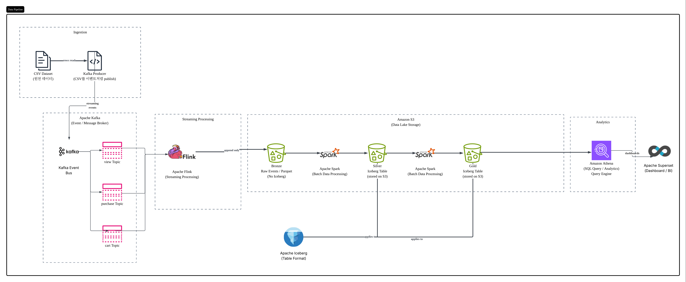

# 최종 프로젝트 — 이커머스 행동 로그 기반 Iceberg 데이터 플랫폼

## 1. 도메인 정의 + 데이터셋 + 핵심 KPI

### 1-1. 데이터셋

**선정: [eCommerce behavior data from multi category store](https://www.kaggle.com/datasets/mkechinov/ecommerce-behavior-data-from-multi-category-store)** (Kaggle, 제공자 mkechinov / REES46 Marketing Platform)

대형 멀티카테고리 온라인 스토어의 실제 사용자 행동 이벤트 로그. `event_type`(view / cart / purchase), `event_time`(초 단위 실제 타임스탬프), `product_id`, `category_id`, `category_code`, `brand`, `price`, `user_id`, `user_session` 컬럼으로 구성. 전체 2019-10~2020-04(7개월, 약 2.85억 건)이 대상이며, 현재는 **2019-10 한 달(4,245만 건, 일 평균 136.9만 건)** 로 파이프라인을 구성하고 있다.

### 1-2. 가정 페르소나 ↔ 지표 대응

| 이해관계자    | 묻는 질문              | 대응 지표                      | 위치     |
| -------- | ------------------ | -------------------------- | ------ |
| **경영진**  | 오늘 얼마 벌었나          | 일별 매출(GMV)                 | 핵심 1   |
| **마케팅팀** | 어디서 이탈하고, 얼마를 놓치나  | 퍼널 전환율 / Cart 이탈률·놓친 매출    | 핵심 2·3 |
| **상품팀**  | 어떤 카테고리·상품이 매출을 끄나 | 카테고리·브랜드 기여도 / 상품 파레토      | 보조     |
| **데이터팀** | 파이프라인이 건강한가        | 파이프라인 지연 / 데이터 품질 / 테이블 헬스 | 운영 탭   |

### 1-3. 핵심 KPI 3개

**결과 → 과정 → 손실** 순으로 이커머스 퍼널 전체를 한 줄로 설명하도록 구성했다.

| #   | KPI                  | 답하는 질문       | 정의                                                                             |
| --- | -------------------- | ------------ | ------------------------------------------------------------------------------ |
| 1   | **일별 매출 (GMV)**      | 얼마 버는가       | `event_type = purchase`의 `price` 합. 이벤트 시점 가격 사용                               |
| 2   | **퍼널 전환율**           | 얼마나 잘 전환되는가  | view → cart → purchase 단계별 전환율. `(user_session, product_id)` 기준으로 실제 연결된 것만 집계 |
| 3   | **Cart 이탈률 / 놓친 매출** | 어디서 얼마를 놓치는가 | 담고 사지 않은 비율과 그 금액                                                              |

#### 보조 지표 (드릴다운 탭 — 상품팀)

- **카테고리 / 브랜드별 매출 기여도** — GMV를 카테고리·브랜드 축으로 분해
- **상품 파레토** — 상위 1% / 5% / 10% 상품의 GMV 점유율

#### 운영 메트릭 (운영 탭 — 데이터팀)

- **파이프라인 지연 (SLA)** — Kafka 발행 → S3 적재 구간별 지연
- **데이터 품질** — event_type 비율, null 비율, 가격 이상치 추이
- **Iceberg 테이블 헬스** — 파일 수·평균 크기

---

## 2. 전체 아키텍처 (그림 + 설명)

### 2-0. 구간별 상세

| 구간                | 구성                                                                                                                 | 비고                                    |
| ----------------- | ------------------------------------------------------------------------------------------------------------------ | ------------------------------------- |
| **수집**            | `kafka_producer.py` — `event_type`으로 토픽 분기, `event_id`(sha256) 부여, 발행 간격만 `--speed` 배속으로 압축(`event_time` 값은 원본 유지) | 구현 완료                                 |
| **버퍼**            | Kafka (KRaft, 단일 브로커) — 토픽 3개 × 파티션 3, `key = user_id`                                                             | 동일 유저 이벤트가 항상 같은 파티션으로                |
| **스트리밍 처리**       | `raw_zone_consumer.py` (Flink Table API) — **토픽당 독립 잡 1개, 총 3개**                                                   | 한 잡이 죽어도 나머지 zone은 계속 적재              |
| **Bronze**        | S3 plain Parquet, append-only — `raw/{zone}/raw_date=YYYY-MM-DD/raw_hour=HH/`                                      | 체크포인트 30초 간격, `group-offsets`로 재시작 복구 |
| **Silver / Gold** | Spark 배치 → Iceberg 테이블 (Glue 카탈로그). DDL은 `code/ddl/`                                                               | 테이블 정의 완료, 적재 잡 작성 예정                 |
| **조회 / BI**       | Athena(Glue Catalog) → Superset                                                                                    | 비즈니스 KPI 탭 + 운영 메트릭 탭                 |
| **오케스트레이션**       | Airflow — Silver/Gold 배치 + Iceberg 매니지먼트(컴팩션 / 스냅샷 만료)                                                             | 예정                                    |

### 2-1. 계층별 엔진 선택 근거

| 구간                     | 엔진                 | 근거                                                                                                      |
| ---------------------- | ------------------ | ------------------------------------------------------------------------------------------------------- |
| Kafka → Bronze         | **Flink**          | 레코드 단위 스트리밍 처리 (아래 참고)                                                                              |
| Bronze → Silver → Gold | **Spark 배치**       | KPI가 전부 일 단위 집계라 서브분 신선도가 불필요. MERGE·self-join 등 관계형 연산 중심                                              |
| 조회                     | **Athena**         | 쿼리당 스캔 과금 방식으로 계속 리소스를 점유하는 Trino보다 더 적합                                                                |
| BI                     | **Superset** (미확정) | 셀프호스팅이라 필요할 때만 기동하면 되고 `PyAthena`로 Athena에 연결된다. 대안 검토 후 확정 예정                                          |

**Flink 선택 이유** — 현재 KPI는 일 단위 집계라 초 단위 처리 지연이 중요하지 않지만, 향후 실시간 탐지·알림 요구를 고려해 레코드 단위 처리가 가능한 Flink를 택했다.

## 3. 메달리온 3계층 의사결정

> 각 결정의 상세 근거와 실측 데이터는 [`code/ddl/README.md`](code/ddl/README.md), DDL은 [`code/ddl/`](code/ddl/) 참고.

| 계층     | 포맷            | 파티션 기준                   | 핵심 결정        |
| ------ | ------------- | ------------------------ | ------------ |
| Bronze | plain Parquet | **수집 시점** (`ingest_ts`)  | 판단 없이 원본 보존  |
| Silver | Iceberg       | **발생 시점** (`event_time`) | 테이블 2개로 분리   |
| Gold   | Iceberg       | 집계 날짜                    | KPI별 일 단위 집계 |

### 3-1. Bronze — plain Parquet

Kafka에서 받은 것을 **판단 없이 그대로** 보존한다. 덧붙이기(수집 시각, 파티션 키, Kafka 좌표)와 포맷 변환까지만 하고, dedup·타입 캐스팅·join은 Silver로 미룬다. 파티션을 **수집 시점**으로 잡아 늦게 도착한 이벤트도 항상 현재 파티션에 쌓이므로 과거 파티션을 재오픈할 일이 없다.

**Iceberg를 쓰지 않은 이유** — Bronze에서 Iceberg가 사는 지점(스몰파일 정리·스키마 진화)은 겪기 전엔 비용을 모르는 반면, 커밋마다 메타데이터는 확실히 쌓인다. 먼저 운영하며 실측하고 전환 시점을 근거로 정한다. 현재 50만 건/8분 재생 시 zone당 16~18개 파일로, 볼륨이 작은 토픽에서 파일이 과도하게 작아지는 현상이 이미 보인다.

**Paimon을 쓰지 않은 이유** — 강점인 LSM 업서트를 append-only인 Bronze에서 쓸 일이 없고, 조회를 Athena로 하기로 한 이상 Paimon 미지원이 직접적인 제약이다.

### 3-2. Silver — 테이블 2개

| 테이블             | grain (한 행 = )                    | 하는 일                 |
| --------------- | --------------------------------- | -------------------- |
| `silver_events` | 이벤트 1건                            | dedup·타입 캐스팅·카테고리 분해 |
| `silver_funnel` | (`user_session`, `product_id`) 1쌍 | 흩어진 이벤트를 하나의 여정으로 조립 |

**grain을 `(user_session, product_id)`로 잡은 이유** — `order_id` / `cart_id` / `quantity`가 모두 없어 **실제 거래 단위를 복원할 수 없다**(특히 `quantity`가 없음). 따라서 관측 가능한 범위에서 이게 최선으로 판단

**지표별 소스 테이블을 고정한다** — `silver_funnel`은 같은 세션에서 같은 상품을 두 번 산 경우가 한 행으로 접히므로, 이러한 경우 가격 컬럼이 있어도 **GMV를 여기서 뽑으면 과소집계된다.** GMV·카테고리·파레토는 `silver_events`에서, 전환율·이탈률·놓친 매출은 `silver_funnel`에서만 추출

**어트리뷰션은 두 개로 분리한다** — 세션 안에서 끝나는 전환(`purchased`)과 다른 세션에서 발생한 지연 전환(`converted_later`)은 시간 규모가 자릿수로 다른 별개 현상이다. 나눠두면 **세션 전환율은 확정 후 불변**이고, 지연 전환은 **최종 전환율에만 반영**된다.

> 윈도우 값(세션 1시간 / cross-session 7일)은 임의로 잡은 초기값이다. Silver 구축 후 실제 분포를 측정해 확정할 예정

### 3-3. Gold — KPI별 집계

| 테이블                 | 지표                      | 소스              | 갱신        |
| ------------------- | ----------------------- | --------------- | --------- |
| `gold_daily_gmv`    | 핵심 1 (GMV)              | `silver_events` | append    |
| `gold_funnel_daily` | 핵심 2·3 (전환율, 이탈률·놓친 매출) | `silver_funnel` | **MERGE** |
| `gold_category_gmv` | 보조 (기여도, 파레토)           | `silver_events` | append    |
| `gold_pipeline_sla` | 운영 (지연)                 | `silver_events` | append    |
| `gold_data_quality` | 운영 (품질)                 | `silver_events` | append    |

Iceberg 테이블 헬스는 별도 테이블 없이 **메타테이블 직접 조회**로 처리한다.

**MERGE가 필요한 건** `gold_funnel_daily` **하나:** cart → purchase 지연 때문에 upsert 필요. 나머지는 과거 값이 변하지 않아 append로 충분

## 4. 이 도메인에서 Iceberg가 가장 가치 있는 지점

*TODO* 

## 5. 운영 헬스 체크 쿼리 모음

*TODO*

## 6. 대시보드 (스크린샷 + 운영 메트릭)

*TODO*

## 7. 100x 스케일 아웃 시나리오 (설계만, 구현 X)

*TODO*

## 8. 장애·운영 시나리오

*TODO*

## 9. 멱등성 / 재처리 가능성 설계

*TODO*