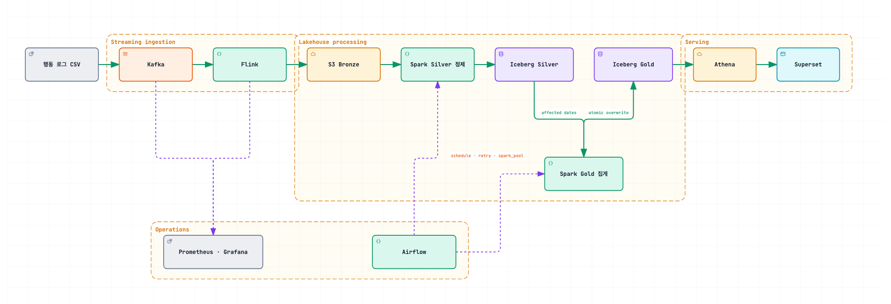
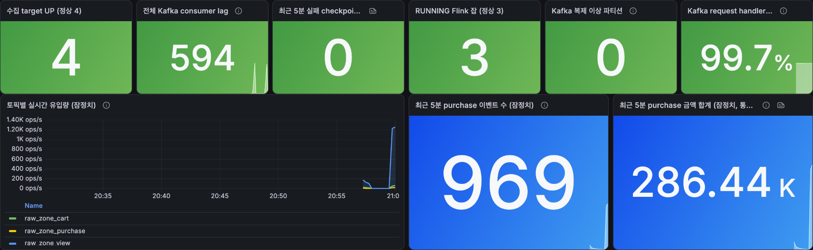

<!-- _class: lead -->

# 이커머스 행동 로그 Iceberg Lakehouse

Kafka → Flink → S3 Bronze → Spark/Iceberg Silver·Gold → Athena/Superset

---

## 핵심 문제

지연 도착 이벤트와 세션을 넘는 구매가 **이미 계산한 과거 결과를 바꾼다.**

- 늦게 도착한 view/cart → 기존 퍼널의 최초 시각·집계값 변경
- 새 purchase → 같은 사용자·상품의 **과거 다른 세션** 퍼널 전환 여부 변경

전체 재계산도 가능하지만 데이터가 커질수록 비용이 크다.
→ 영향 키로 재계산 범위를 줄이고 Iceberg로 원자적으로 갱신한다.

---

## 데이터 규모 · KPI

Kaggle *eCommerce behavior data from multi category store*
전체 7개월 약 2.85억 건 중 **2019년 10월 4,245만 건**을 기본 사용

| KPI | 정의 | 대상 |
| --- | --- | --- |
| GMV | `purchase` 이벤트의 `price` 합 | 경영진 |
| 퍼널 전환율 | `(user_session, product_id)`별 view·cart·purchase | 마케팅 |
| Cart 이탈률 · 미전환 금액 | cart 후 미구매 비율·금액 | 마케팅 |
| 카테고리 GMV | 카테고리별 기여도 | 상품팀 |
| 운영 품질 | 지연·NULL·가격 이상치·Iceberg 파일 상태 | 데이터팀 |

`order_id`/`quantity` 없음 → 구매 건수 대신 **purchase 이벤트 수**로 표기

---

## 전체 아키텍처

---

## Superset — 비즈니스 KPI와 배치 품질

| 비즈니스 KPI | 배치 결과·데이터 품질 |
| --- | --- |
|  |  |

커밋된 Gold KPI와 일별 데이터·Iceberg 품질을 같은 조회 기간으로 확인한다.

---

## Grafana — 스트리밍 상태와 즉시 알림

Kafka·Flink 상태를 실시간 감시하고, 임계값 위반이 지속되면 Slack으로 알린다.

---

## 메달리온 계층

| 계층 | 테이블 | Grain | 책임 |
| --- | --- | --- | --- |
| Bronze | `raw/{view,cart,purchase}` | 이벤트 1건 | 원본·메타데이터 보존 |
| Silver | `silver_events` | 이벤트 1건 | dedup, 타입 변환 |
| Silver | `silver_funnel` | `(user_session, product_id)` | 행동 여정, cross-session 전환 |
| Gold | `gold_daily_gmv` 외 4개 | 일 단위 | GMV·전환율·품질 KPI |

GMV는 `silver_events`, 전환율은 `silver_funnel`에서 계산 — **서로 다른 grain을 합산하지 않는다.**

---

## Cross-session 전환

같은 사용자가 **다른 세션**에서 같은 상품을 구매하면 과거 세션의 퍼널에 전환을 표시한다.

- `converted_later`: 다른 세션의 후속 구매 여부
- `later_purchase_ts` / `later_purchase_gap_sec`

| 탐지 윈도우 | 포착된 지연 전환 |
| --- | ---: |
| 7일 | 340,535건 |
| 30일 | 394,493건 |

관측 기간이 31일뿐이라 Cart 이탈률은 **상한**, 지연 전환 수는 **관측 가능한 하한**으로 해석한다.

---

## 트러블슈팅 1. 잘못된 Gold 집계 기준

**증상**
- Funnel에서 GMV 계산 → 반복 구매가 접혀 **7.1% 과소집계**
- `purchases / carts`를 전환율로 사용 → cart 미경유 구매가 섞여 **110%**
- NULL category 처리 전 rollup 구분 → 결측 33.88%가 `ALL`로 오인

**원인**: 이벤트·퍼널 grain 혼합, 분자가 분모의 부분집합이 아님, 실제 NULL과 grouping NULL 미구분

**대응**: GMV는 `silver_events`에서, 전환율은 `carted=1 AND purchased=1` 기준으로, NULL은 `unknown`으로 치환 후 `grouping()`으로 `ALL` 구분

---

## 트러블슈팅 2. MOR 무조건 UPDATE로 파일 폭증

같은 Funnel 배치를 **2회 반복 처리** — 결과 행 수·KPI·논리 키 중복(0건)은 동일했지만:

| 테이블 | data files | position delete files |
| --- | ---: | ---: |
| `silver_funnel` | 31 → **83** | 0 → **52** |
| `silver_events` | 34 → 36 | 0 → 2 |

**원인**: `updated_at = current_timestamp()`가 매번 값이 달라져, `WHEN MATCHED THEN UPDATE SET *`가 실제 데이터가 같아도 전부 갱신 → MOR이 기존 행을 delete file로 표시하고 새 행을 씀

**대응**: `updated_at`을 제외한 실제 컬럼이 달라졌을 때만 UPDATE하도록 변경. 재검증 결과 동일 배치 재실행 시 파일 증가 없음, compaction으로 잔재 정리(83→31, 52→0)

---

## 트러블슈팅 3. PyFlink 커스텀 지표의 타입 제약

**증상**: 실시간 purchase 금액 누적값을 Prometheus Counter로 노출하려는데 소수점 값을 담을 수 없음

**원인**: PyFlink `Counter.inc(n: int)`과 `Gauge` 콜백 모두 정수 전용이라 float를 그대로 못 씀. 원본에 통화가 없어 금액 단위도 가정할 수 없음

**대응**: 금액을 100배 정수로 스케일링해(`Decimal`로 변환해 float 반올림 오차 방지) Counter에 담고, Grafana 쿼리에서 다시 `/100`. purchase 금액은 topic 소속만 신뢰하지 않고 `event_type == "purchase"`도 함께 확인

**검증**: 같은 시간대 Bronze 실제 적재량과 완전히 일치(view 56,572 / cart 2,627 / purchase 801건, 금액 합계 238,590.33·통화 미상)

---

## Bronze는 plain Parquet, Silver·Gold는 Iceberg

평범한 기술 선택(Kafka·Airflow·S3·Athena·Superset 채택)은 생략하고 설명이 필요한 것만 다룬다.

**배경**: 수집 원본은 변형 없이 보존해야 하고, 정제·집계 데이터는 지연 도착으로 과거 결과가 바뀐다

| 계층 | 형식 | 이유 |
| --- | --- | --- |
| Bronze | append-only plain Parquet | 단순 수집·재처리 목적, 갱신 불필요 |
| Silver·Gold | Iceberg format v2 | MERGE, 원자적 파티션 교체, snapshot 필요 |

**포기한 대안**: 전 계층 plain Parquet(갱신·원자성 직접 구현 부담), Bronze까지 Iceberg(현재 append-only 요구에 비해 카탈로그 복잡도 과함)

---

## 영향 키 기반 퍼널 재계산

전체 재구축은 정확하지만 데이터가 커질수록 비용이 크다. **직접 영향 키 + 구매 전파 영향 키**만 재계산한다.

- 직접 영향 키: 이번 배치에서 바뀐 `(user_session, product_id)`
- 전파 영향 키: 새 purchase가 같은 `(user_id, product_id)`의 과거 30일 퍼널에 미치는 영향
- 두 집합을 합쳐 영향 키의 이벤트 이력을 **다시** 읽는다 (`converted_later=1` 행도 제외 안 함)

**검증**: 증분·전체 재구축 결과 13,424,825행, 양방향 차집합 0건 일치 (`updated_at` 제외)

---

## Silver MOR · Gold COW 혼용

| 근거 | 값 |
| --- | --- |
| COW 재작성 비용(컬럼 1개 UPDATE) | 1,329,334행 / 105~118MB |
| 파티션 가지치기 | 하루 2.28MB vs 전체 31일 78.3MB (약 34배) |

- Silver: 증분 MERGE가 30일 범위까지 건드릴 수 있어 **MOR**로 재작성 부담을 낮춤
- Gold: 영향 날짜 전체를 overwrite하므로 row-level delete의 이점이 작아 **COW** 유지, BI 조회도 단순

**포기한 대안**: 전 테이블 COW(Silver 재작성량 과다), 전 테이블 MOR(Gold에 불필요한 delete 비용)

---

## Flink 선택 이유와 실시간 KPI

> Spark는 정합성이 중요한 배치 재계산을 담당하고, Flink는 Kafka 이벤트의 지속적인 수집과 즉시 관측을 담당한다.

- Kafka 이벤트를 끊김 없이 소비하고 checkpoint로 offset을 복구
- topic(view/cart/purchase)별 독립 처리와 parallelism 확장
- backpressure·checkpoint 상태를 즉시 관측 가능 (Grafana 참고)
- Bronze 적재와 **실시간 잠정 KPI**(이벤트 유입량, purchase 건수·금액)를 같은 job에서 계산

잠정 KPI는 Bronze 실측과 대조해 정확히 일치함을 검증했다(트러블슈팅 3 참고). 재처리·중복 제거·30일 전환 창은 반영되지 않아 확정 GMV가 아닌 운영 신호로만 쓴다.

---

## 개선 계획

- Iceberg 재작성/삭제 주기를 일별 누적 관측 기반으로 확정 (현재 주 1회는 초기값)
- 입력 레코드 검증 계약과 레코드 단위 DLQ 추가로 데이터 신뢰성 강화
- Grafana sanity 임계값 정밀화, Airflow 실패·Bronze freshness 알림 확장
- 부하 실측을 늘려 10x·100x 스케일아웃 필요성 재평가
